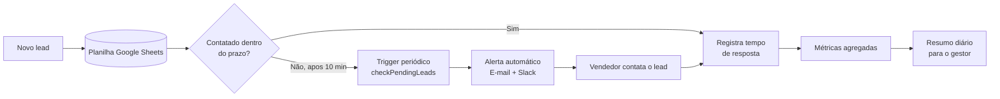

# sales-lead-response-time-monitor
Alerta automático para leads sem resposta — reduz o tempo médio de contato em times de vendas usando Google Apps Script.
# Sales Lead Response Time Monitor

Automação em Google Apps Script que reduz o tempo de resposta a leads comerciais, disparando alertas automáticos quando um lead fica sem contato além de um prazo configurável.

> **Sobre este projeto:** é um projeto autoral de estudo/portfólio, construído para praticar automação de processos e pensamento de produto aplicados a um problema real e comum em times de vendas — não usa dados de nenhuma empresa específica. Os números de impacto na seção [Resultados](#resultados-simulados) vêm de uma simulação com dados sintéticos, reproduzível em `simulation/generate_data.py`.

## O problema

Em times de vendas pequenos e médios, é comum que novos leads caiam em uma planilha ou inbox sem nenhum mecanismo automático de cobrança. O tempo de resposta acaba dependendo inteiramente de alguém lembrar de checar — e cada minuto de atraso reduz a chance de conversão do lead.

## A solução

Um script leve, rodando dentro do próprio Google Sheets (sem infraestrutura extra), que:

1. Registra o horário de entrada de cada lead
2. Verifica periodicamente quais leads ainda não foram contatados
3. Envia alerta automático (e-mail + Slack opcional) para o vendedor responsável e o gestor quando o prazo é ultrapassado
4. Registra o tempo de resposta real assim que o lead é marcado como contatado
5. Consolida métricas de performance (tempo médio, % dentro da meta) e envia um resumo diário ao gestor

## Arquitetura



## Stack

| Camada | Ferramenta | Por quê |
|---|---|---|
| Automação | Google Apps Script | Roda nativamente sobre Sheets/Gmail, sem servidor ou custo de infraestrutura |
| Armazenamento | Google Sheets | Baixa fricção — qualquer time de vendas pequeno já usa ou consegue adotar |
| Alertas | Gmail (`MailApp`) + Slack Incoming Webhook (opcional) | Cobre times que vivem no e-mail e times que vivem no Slack |
| Simulação de impacto | Python (numpy, pandas, matplotlib) | Gera e visualiza dados sintéticos de forma reprodutível |

## Resultados simulados

Simulação com 500 leads sintéticos por cenário (`simulation/generate_data.py`, seed fixa = 42, reproduzível):


| Métrica | Antes (manual) | Depois (com automação) |
|---|---|---|
| Tempo médio de resposta | 107,1 min | 24,8 min |
| Leads respondidos dentro da meta (30 min) | 16,4% | 72,8% |

Esses números **não são de uma empresa real** — são gerados por um modelo estatístico (distribuição log-normal) construído para representar o padrão esperado: resposta manual mais dispersa e imprevisível vs. resposta com escalonamento automático no limite configurado.

## Como rodar

### 1. Automação (Google Apps Script)

1. Crie uma Google Sheet com uma aba chamada `Leads` e as colunas: `Timestamp`, `Lead Name`, `Email`, `Assigned Rep`, `Rep Email`, `Contacted`, `Contact Timestamp`, `Response Minutes`, `Alert Sent`
2. Abra **Extensões → Apps Script** e cole o conteúdo de [`src/Code.gs`](src/Code.gs)
3. Edite as constantes em `CONFIG` (e-mail do gestor, limite de minutos, webhook do Slack se for usar)
4. Rode a função `setupTriggers` uma vez, manualmente, para instalar os gatilhos automáticos
5. (Opcional) Se novos leads chegam por Google Form, vincule o formulário à planilha e configure o trigger `onFormSubmit`

### 2. Simulação de impacto (Python)

```bash
cd simulation
pip install -r requirements.txt
python generate_data.py
```

Isso regenera `assets/response_time_impact.png` e imprime as métricas no terminal.

## Possíveis melhorias futuras

- Migrar o armazenamento de Sheets para um banco real (ex: Firestore) se o volume de leads crescer
- Adicionar dashboard em tempo real (ex: Looker Studio conectado à planilha)
- Priorizar alertas por valor estimado do lead, não só por tempo decorrido

## Autora

**Nathalya Domingos Schefer**
Analista de Implementação → Produto
[LinkedIn](https://www.linkedin.com/in/nathalya-schefer-5416b721a/) · nathalya.schefer@gmail.com

## Licença

MIT — sinta-se livre para adaptar para o seu próprio time.
